## Setup Instructions (Local)

 - at ```server/config/``` folder create ```dev.js``` and copy&past the following code:

//DON'T COMMIT IT TO GIT HUB - ADD THIS FILE TO .GITIGNORE
```js
module.exports = {
googleClientID: <your-google-client-id-credentials>,
googleClientSecret: <your-google-client-secret-credentials>,
mongoURI: <your-mongoDB-credentials>,
cookieKey: <can-be-any-long-combination-of-string-you-make-it-up>
}
```
- Run ```npm install```
- Run ```npm run dev```
- Enter credentials for MongoDBSendgrid & Stripe API's. 
- ```rails server``` to run the rails server
- Load http://localhost:3000/ in the browser   


# HOW TO START

 - Run ```npm install```
 - Run ```npm run dev```

# WHAT'S IT ABOUT?: 
The idea behind omniCoin is to create a central repository for all things crypto for beginners wanting to start learning about crypto currency. It is a one stop shop for all you might need to know when getting started. With sections for finding out about how different crypto currencies fluctuate, guides on the different terminology used and then helpful links to outside resources such as books, movies, podcasts and humor. 

# THE TEAM:
Our team consisted of: 
Armstrong Ashton-Lewis
Edson Nascimento
Natalia Chamon
Benedicte Powell

The tasks for the project were delegated out amongst the team, Edson took care of the backend and building the code framework for our project, as well as many other little odd jobs and bug fixing. Armstrong handled the making of the logo, writing content for our project, modals for the project, presentation of the application, keeping morale high and like Edson, odd jobs here and there! Natalia and Benedicte shared the design side of the project picking colours and working together closely, on top of that Natalia also made the nav bar and a bunch of the HTML & CSS elements, initial wireframes and odd jobs as well. Benedicte did the HQ wireframes, CSS elements, small fixes of cleaning up elements around the application. 
Overall everyone contributed throughout and we worked cohesively as a team, being sure to use branches and pulling frequently from the main branch. 


# Visit omniCoin website at: https://omni-coin.herokuapp.com/   

# Visit GitHub repository (repo) at: https://github.com/Kryptic2020/omniCoin, original repo at:https://github.com/Ausiarm/omniCoin

### Purpose
   OmniCoin aim to supply at a basic level, introduction to the crypto market and guide on how to trade, as educational tool for beginers. OmniCoin provides free education opportunity to every individuals with no exception, it includes entrepreneurs, businesses and organizations, does not matter how big or small size they are.  

 # Functionality / features:  
 - Currency and Coin selectors
 - There is a graph that shows the rise and fall based on the slected currency and coin
 - Guide area with a list linked to modals that explains terminology, how to trade and other aspects of cryptocurrencies
 - Dive Deeper which has links to helpful and informative external sites, podcasts and other resources.

# Sitemap 
 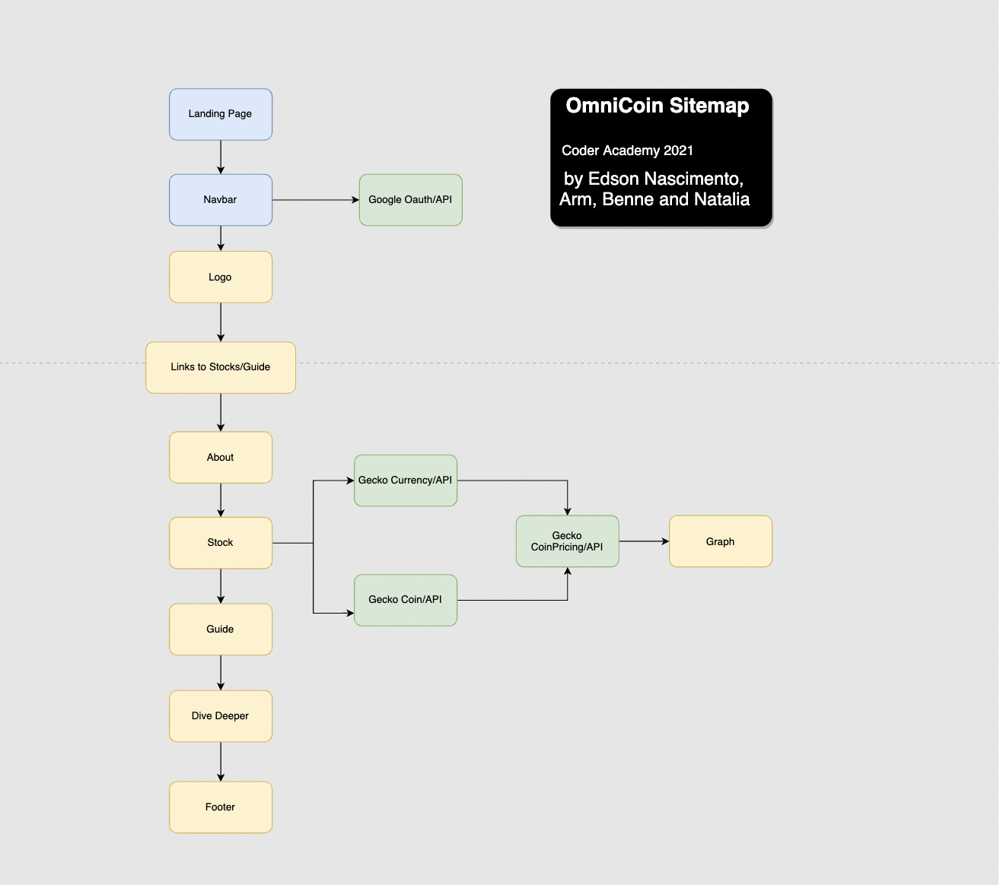

# Page  
 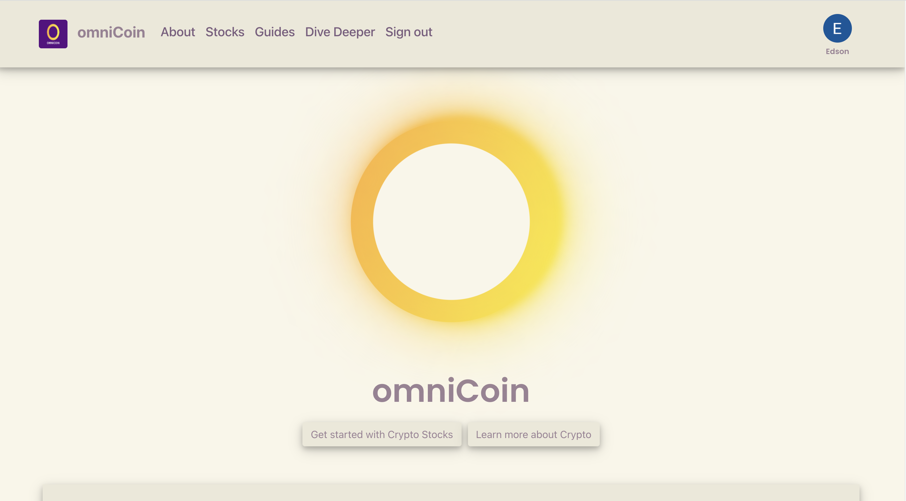  
 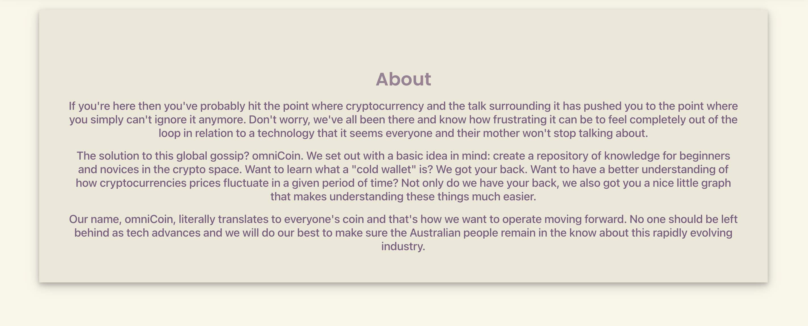
 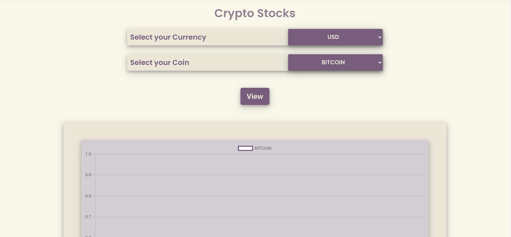
 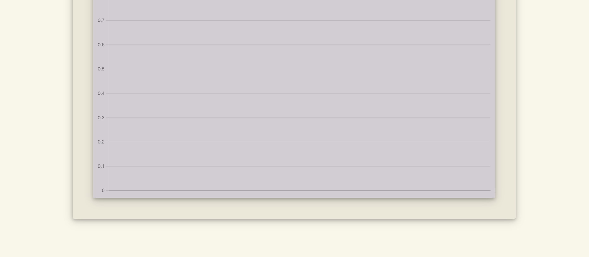
 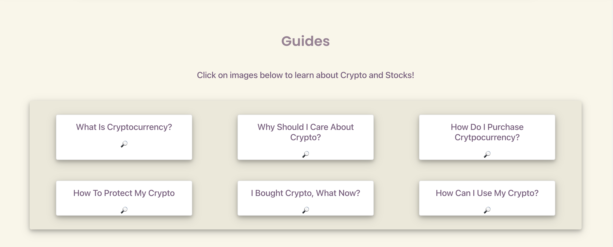
 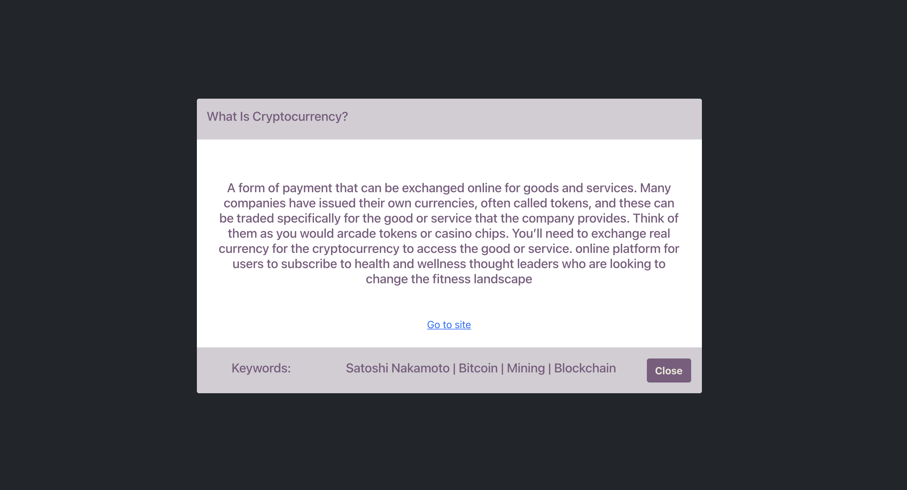  
 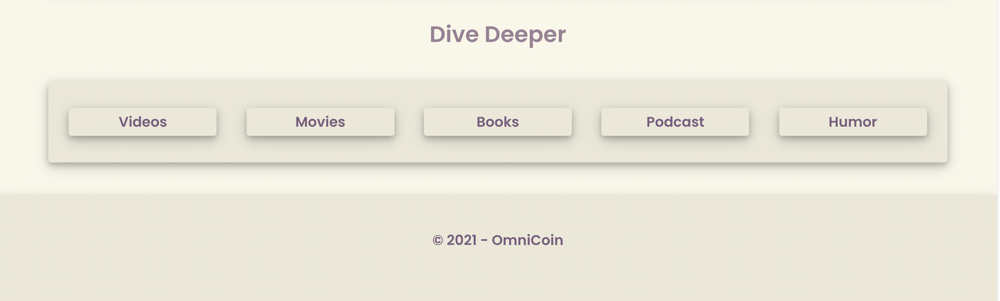
 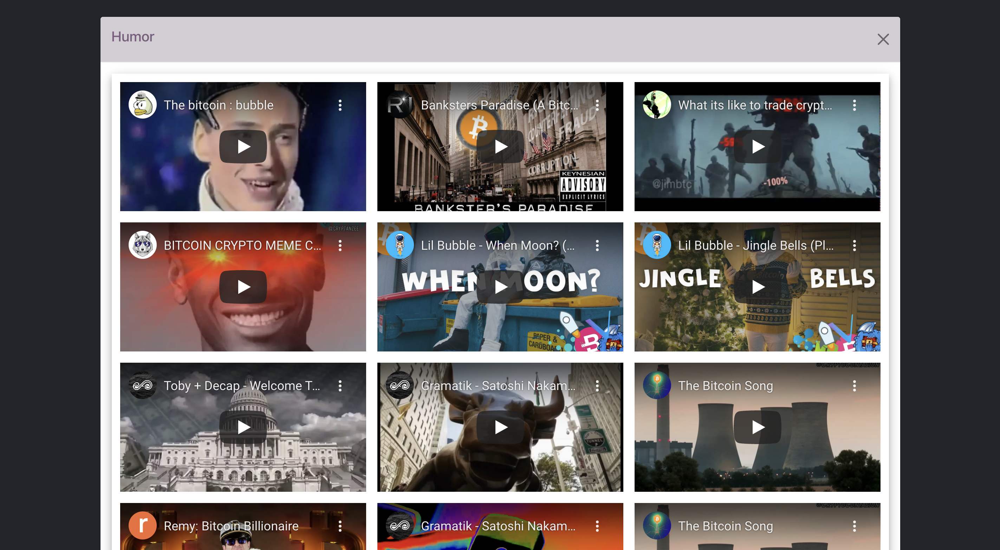
 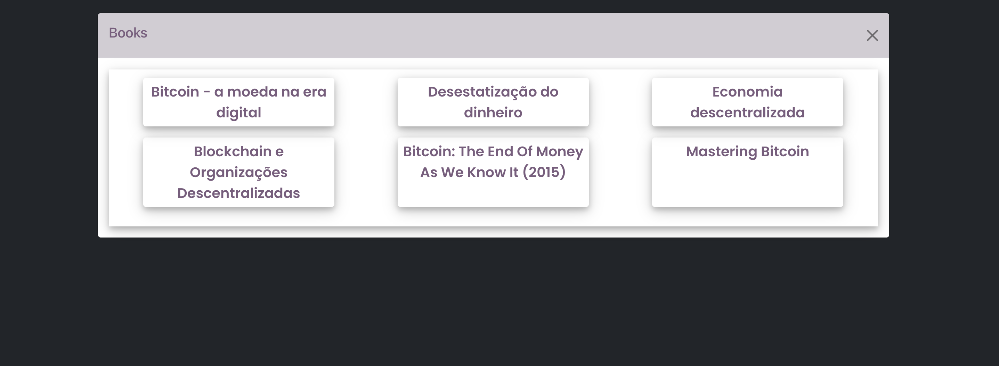

 # Target audience
  - For any individual, entrepreneurs, businesses and organizations interested in Crypto and Crypto market!    

 # Tech Stack
- MERN - MongoDB, Express, ReactJS and NodeJS.
- Bootstrap, Styled Component: front end design 
- Heroku: deployment platform.
- Google: Oauth2.0 google authentication API.
- Gecko: Crypto API.
- Git version control: 16 branches and more than 60 commits at the original repo: https://github.com/Ausiarm/omniCoin  


# User stories  

### ***As an individual***
- I want to learn how to buy and sell crypto
- I want to find related resources such us news, books and movies.
  
# Wireframes   
### Colour- palet

   

### Original draw
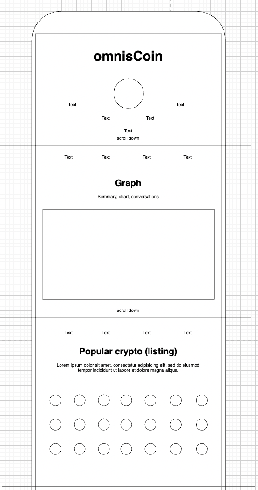  


# ERD  
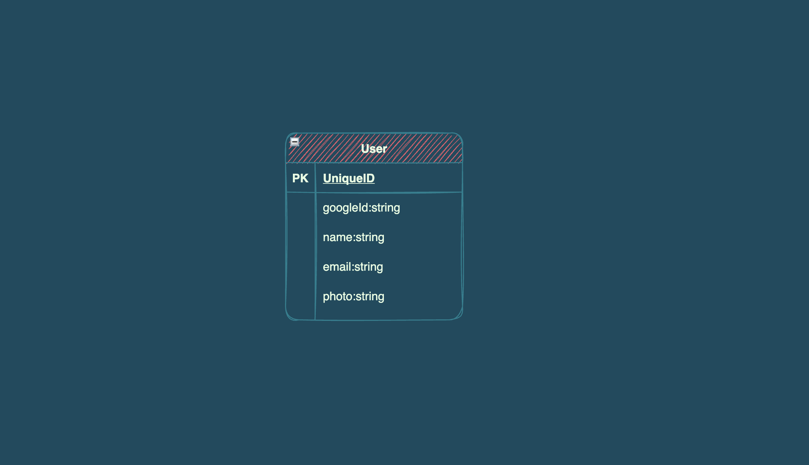   

# Third Party Services
- google Oauth
- Gecko API - Crypto API's


# Libraries

### Back-end
```js
 "dependencies": {
    "concurrently": "^6.3.0",
    "cookie-session": "^1.4.0",
    "express": "^4.17.1",
    "mongoose": "^6.0.11",
    "nodemon": "^2.0.13",
    "passport": "^0.5.0",
    "passport-google-oauth20": "^2.0.0",
    "react-icons": "^4.3.1",
    "react-router-dom": "^5.3.0"
  }
``` 
### Front-end
```js
 "dependencies": {
    "@testing-library/jest-dom": "^5.11.4",
    "@testing-library/react": "^11.1.0",
    "@testing-library/user-event": "^12.1.10",
    "axios": "^0.23.0",
    "bootstrap": "^5.1.1",
    "chart.js": "^3.5.1",
    "http-proxy-middleware": "^2.0.1",
    "react": "^17.0.2",
    "react-bootstrap": "^2.0.0-rc.1",
    "react-chartjs-2": "^3.1.1",
    "react-dom": "^17.0.2",
    "react-scripts": "4.0.3",
    "styled-components": "^5.3.3",
    "web-vitals": "^1.0.1"
  },
  ```


# Model - MongoDB
```js
const mongoose = require('mongoose');
const { Schema } = mongoose;

const userSchema = new Schema({
  googleId: String,
  name: String,
  email: String,
  photo:String
});

mongoose.model('users', userSchema);
```


# Planning & Execution - Project Management/Git collaboration

This was a 4 days hackathon project where we had 4 participants into this project.

To achieve the best result possible for this project We had followed Agile approach combined with some management tools such as “Trello boards cards” and git versioning system.   

After spending a limited amount of time planning what I would build, We took the first practical step of this project that was to create the initial tasks on Trello board cards, where we had a single card for each small task. Each of this card was set with:  
* Title – A good and short title that identifies the task.
*	Description – Description on what should be done, how it will be done and which tools it should be done.
*	Checklist - Each task usually has included a list of things that can be listed and ticked upon completed until the whole task is accomplished.
*	Attachment – Attach any resource, photo, documentation to support the task
*	Comments – Commenting on a card was very helpful specially for those tasks I had some issues and try different solutions, so I could track and post what I have done and what did work and not work to solve the issue. 
*	Deadline – most of my cards were set with 1 day, so the tasks was distributed in a way that could be achieved within this time frame. 
*	Coloured Labels - to identify type of task, priority (even though we have dead-line feature set on the cards), to identify sections of the project, etc.  
*	Action List – as each task is usually done individually, the cards are classified according to its action status such as “To do”, “Doing” and “Done”, initially all in the To do list and then moved one by one to Doing and after completed it is moved to done list. So, I know exactly what I have to do, what I am doing and what I have done. I also included some cards on a backlog list, kind of undecided tasks I might implement in the future.   

Tasks such as ERD, Wireframe, user stories, Sitemap, Features, pages, styling, API’s, issues were tracked using Trello cards.  
This technique give us total control of tasks in a such way that we could push back to `doing` some completed tasks due to changes on the scope of the project, so moving cards helped a lot during unexpected upgrading and downgrading of the project.  

We also combined some of the cards with branching technique on git where a new branch was created for each new card feature and merged to the main file after accomplished the task, making it easy to revert back to a prior version if needed as easy as to move a card from “done” to “to do” or “doing” stage. 
 

### Below I illustrate all I have mentioned above:

  